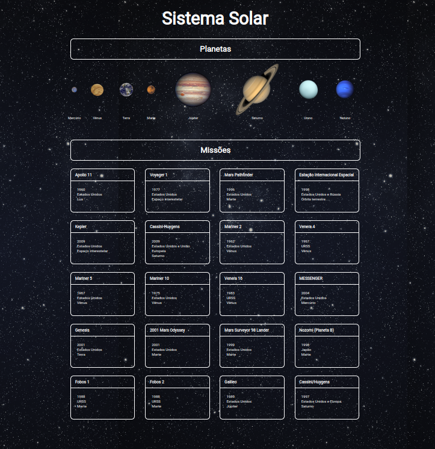

# Projeto Sistema Solar


Projeto desenvolvido durante o curso da Trybe para fixação de aprendizados de componetização no React.

### Desenvolvimento

Os objetivos desse projeto foi desenvolver um modelo visual do sistema solar, em que o usuário será capaz de:

* Visualizar os planetas do sistema solar; 
* Visualizar algumas missões espaciais 


### Habilidades

* Utilizar o método ```render()``` para renderizar componentes;
* Utilizar ```import``` para inserir os componentes em diferentes arquivos;
* Criar componentes de classe em React;
* Criar componentes a partir de um array;
* Usar ```props``` e suas validações;



